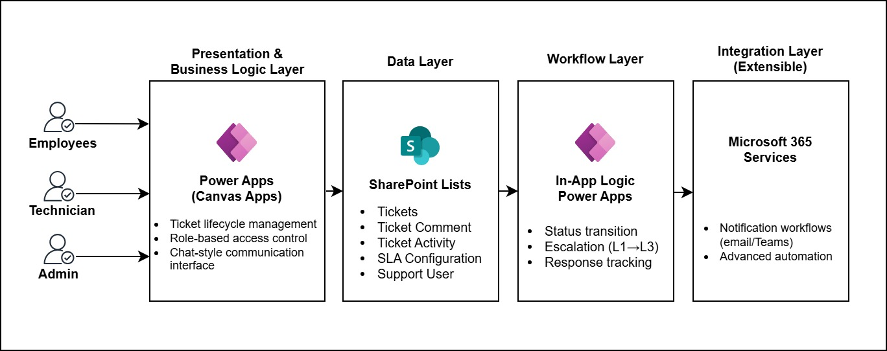
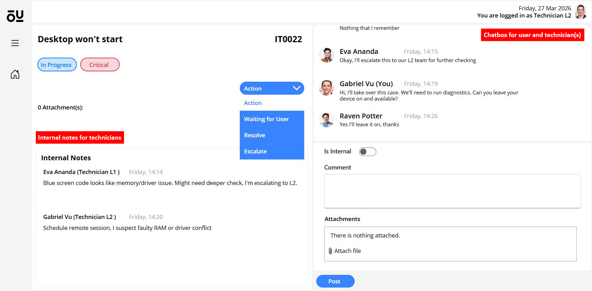
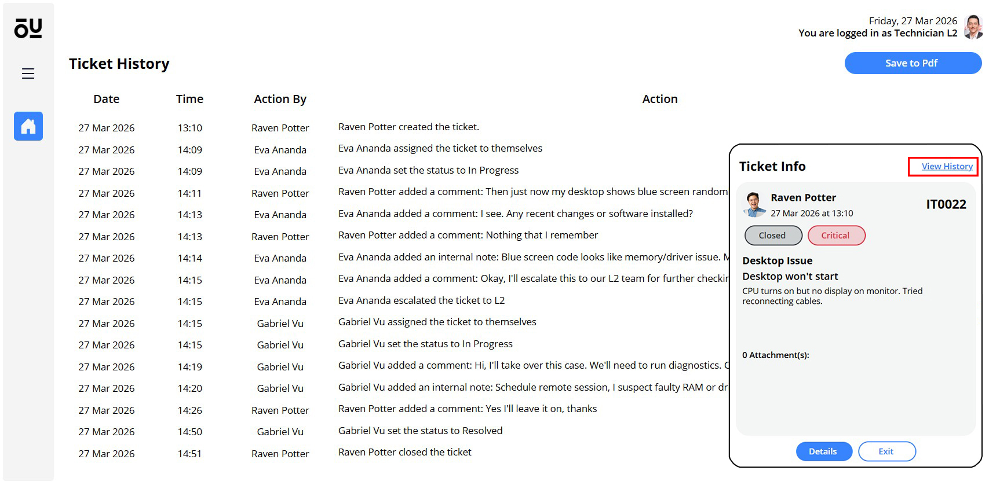
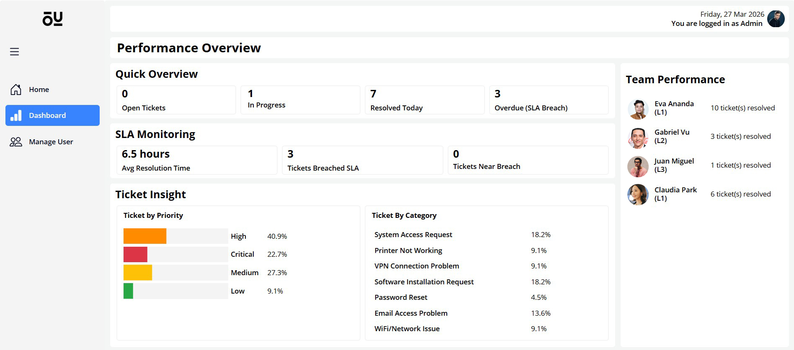

# Helpdesk Ticketing System - Power Apps
A fully functional internal ticketing system built using **Microsoft Power Apps (Canvas Apps)** and **SharePoint Online**, designed to manage support requests, streamline communication, and structure ticket workflows within a Microsoft 365 environment.

The application emphasizes **practical business use cases and enhanced user experience**, including advanced filtering and a **chat-style communication interface** for ticket interactions.

## Technologies
- Microsoft Power Apps (Canvas Apps)
- SharePoint Online
- Microsoft 365
  
## Key Features
### Ticket Management
* Ticket submission with **category, priority, and attachments**
* Dynamic home page logic based on user role:
    * **User:** view only their own tickets
    * **Technician:** view assigned tickets and available tickets based on support level (L1, L2, L3)
* Advanced filtering options:
    * Name, status, priority, category, and time range
    * Clickable indicators for tickets requiring user or technician response
### Ticket Details & Lifecycle
* Role-based action controls:
    * User: Resolve, Close
    * Technician: Waiting for User, Escalate, Resolve
    * Admin: Reopen, Close
* Full ticket lifecycle: **Open → In Progress → Waiting for User → Resolved → Closed**
* Ticket assignment to support personnel
* Escalation logic from **L1 → L2 → L3**
### Chat-Style Communication Interface ⭐
* Conversation-based comment system within each ticket
* Messages dynamically styled based on the **logged-in user**
* Supports:
    * User ↔ Technician communication
    * Technician ↔ Technician communication via **Internal Notes**
* Improves readability and usability compared to traditional comment list
### User & Access Management
* User onboarding via **user management page**
* Role assignment: **User, Technician, Admin**
### Dashboard & Reporting (Admin)
* Monthly operational overview: Open tickets, In-progress tickets, Resolved tickets (daily), AVG resolution time, SLA breaches and near-breach alerts (2 hours threshold)
* Team performance tracking: tickets resolved per technician
* Ticket insights: distribution by priority (custom-built chart), distribution by category

## Feature Walkthrough
### Ticket Creation
https://github.com/user-attachments/assets/54fea63c-c688-4022-b977-2cf9cc5f9ff0

Demonstrates the ticket submission process and how ticket details appear from the user's side.
### Taking Ticket (from Technician Side)
https://github.com/user-attachments/assets/c35a77dc-122e-4bae-945c-d706775d5eaa

Shows the step-by-step process of taking a ticket, posting comments, and resolving the request.
### Ticket Filtering (Technician & Admin Side)
https://github.com/user-attachments/assets/88ce540b-d6fd-4121-a2ce-9c689fe8d211
### Escalation

Illustrates a ticket escalation case where the user, previous technician, and current technician interact through comments, including the use of internal notes.
### Ticket Activity Reporting

Displays the detailed ticket history available to Technicians and Admins, with the option to export records as a PDF for reporting purposes.
### Dashboard

Provides an overview of key ticketing metrics, including workload distribution and resolution performance.
